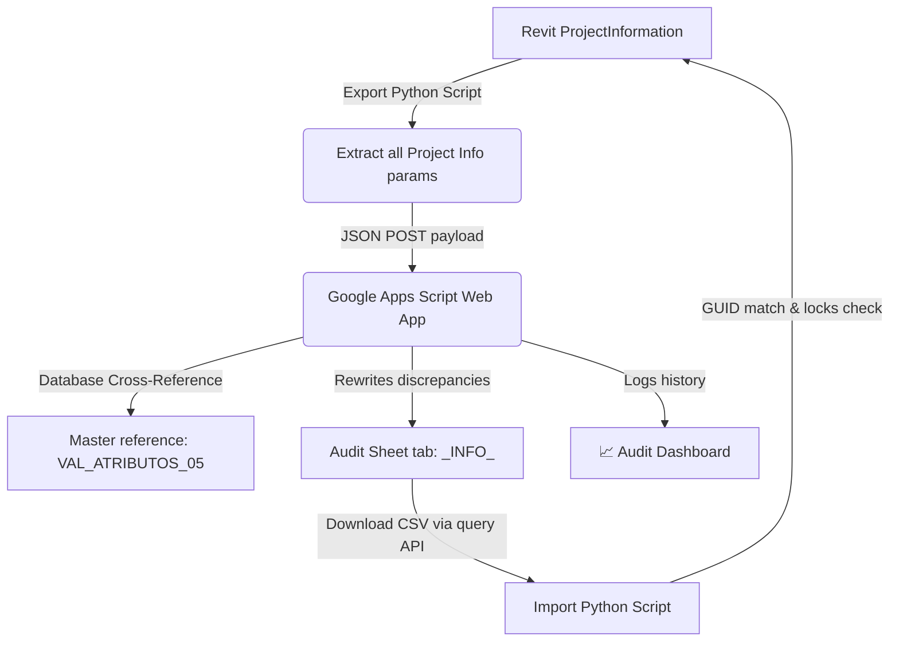

# Project Information Sync & Audit Tool

This integration suite allows bidirectional synchronization and real-time parameter auditing of Revit **Project Information** metadata using Google Sheets.

---

## 📊 System Architecture

This tool operates similarly to the element sync tool, but specifically targets the `ProjectInformation` object, which holds global metadata for the Revit project.

---

## 📁 Files inside this Suite

-   **[export_project_info.py](export_project_info.py)**: Dynamo Python script to extract and send Project Information parameters.
-   **[import_project_info.py](import_project_info.py)**: Dynamo Python script to read and write corrected values back into Revit, matching the Project GUID to prevent corruption.
-   **[google_apps_script.js](google_apps_script.js)**: Google Apps Script to receive data, check standard mappings, and build a logging dashboard.

---

## 🔧 Dynamo Node Configuration

### 1. Export Graph
-   **IN[0]** (String): Deployed Web App URL.
-   **IN[1]** (String): The target Google Sheet URL. 
-   **OUT** (String): Server status. The script automatically opens the browser to the sheet in `IN[1]`.

### 2. Import Graph
-   **IN[0]** (String): Google Sheet URL.
-   **OUT** (String): Report detailing updated, ignored, read-only, or missing parameters.

---

## 🛠️ Setup & Deployment Instructions

### 1. Master Database Setup
The Master Database Google Sheet must contain a tab named `VAL_ATRIBUTOS_05` where:
-   Column headers match the generic mapped parameters (e.g. `BIM_Client_Name`, `BIM_Project_Status`).
-   One column must be named `BIM_Project_Code` (acts as the key search column).
-   One row must match the standard project code configuration (defined as `MASTER_PROJECT_CODE` in the Apps Script).

### 2. Google Apps Script Deployment
1.  Open the audit Google Sheet where you want to receive the project metadata.
2.  Go to **Extensions** -> **Apps Script**.
3.  Replace the default code with the contents of [google_apps_script.js](google_apps_script.js).
4.  Update the `MASTER_DB_URL` variable with your Master Database spreadsheet URL.
5.  Optionally customize the `MASTER_PROJECT_CODE` and `PARAMETER_MAPPING` keys to match your Revit parameter definitions.
6.  Click **Save**, then **Deploy** -> **New deployment**.
    -   *Execute as*: **Me**.
    -   *Who has access*: **Anyone**.
7.  Copy the generated **Web app URL** and connect it to `IN[0]` in your Dynamo Export graph.
