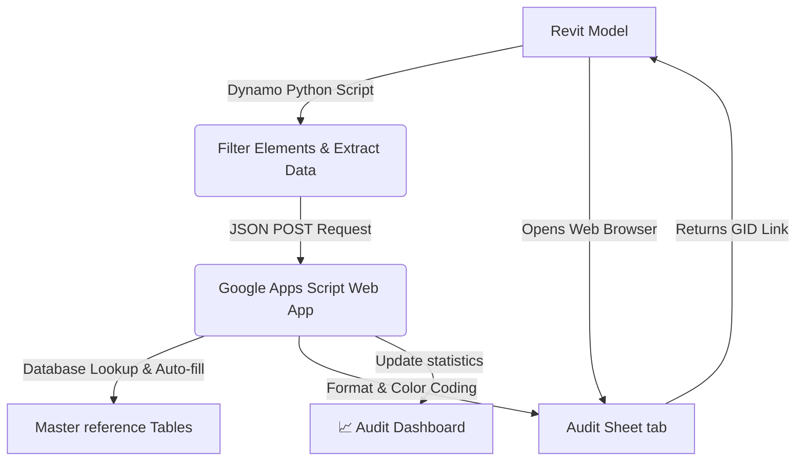

# Revit to Google Sheets BIM Parameter Sync & Audit Tool

This integration suite allows bidirectional synchronization and real-time parameter auditing of Revit elements using a Google Sheets spreadsheet as the master dashboard.

---

## 📊 System Architecture

The tool is split into two components:
1.  **Revit Client-Side (Dynamo/Python)**: Extracts parameter values, filters elements through safety checks, and sends a JSON payload to the Google Web App.
2.  **Cloud-Side (Google Apps Script)**: Processes the data payload, cross-references it with a Master Database, autocompletes matching values, highlights discrepancies, and logs actions to an audit dashboard.

---

## 📁 Files inside this Suite

-   **[export_to_sheets.py](export_to_sheets.py)**: The Python script to be placed inside a Dynamo Python Node.
-   **[google_apps_script.js](google_apps_script.js)**: The JavaScript code to deploy on the Google Sheets script editor.

---

## 🔧 Dynamo Node Configuration (Export)

-   **IN[0]** (String): The deployed Google Web App URL.
-   **OUT** (String): Status log from the Google Apps Script Web App showing a direct link to the generated sheet tab.

---

## 🛠️ Setup & Deployment Instructions

### 1. Master Database Setup
Your Master Database Google Sheet must contain reference tabs for data cross-referencing:
-   `VAL_CLASSIFICATION`: Contains product codes, descriptions, and units of measurement.
-   `VAL_ATRIBUTOS_01`: Maps classification codes to disciplines and subdisciplines.
-   `VAL_ZONING`: Maps zoning identifiers to linear start and end points (Km).
-   `VAL_ATRIBUTOS_03`: Contains status codes and descriptions.

### 2. Google Apps Script Deployment
1.  Open the Google Sheet where you want to receive the audit data.
2.  Go to **Extensions** -> **Apps Script**.
3.  Replace the default code with the contents of [google_apps_script.js](google_apps_script.js).
4.  Update the `MASTER_DB_URL` variable at the top of the script with the URL of your Master Database spreadsheet.
5.  Click **Save** (disk icon).
6.  Click **Deploy** -> **New deployment**.
7.  Select **Web app** as the deployment type:
    -   *Execute as*: **Me** (your-email).
    -   *Who has access*: **Anyone** (this allows the Revit Python script to send requests without OAuth prompts).
8.  Click **Deploy**, authorize permissions, and copy the generated **Web app URL**.

### 3. Run the Tool in Revit
1.  Open your Revit project and launch **Dynamo**.
2.  Set up a string node containing the copied Web App URL and connect it to `IN[0]` of the Python script node.
3.  Run the Dynamo graph. Once completed, your default browser will automatically open to the newly created spreadsheet tab.

---

## 🎨 Spreadsheet Color Coding & Audit States

The Apps Script automatically applies visual feedback to the generated sheets:
-   🟦 **Light Blue (Inputs)**: Editable parameters that are extracted directly from Revit (e.g., descriptions, zoning, status).
-   🟩 **Light Green (Validated)**: Fields that successfully matched database records and were autocompleted (e.g., Discipline, Units).
-   🟧 **Light Orange (Error/Warning)**: Missing fields or descriptions that do not exist in the database, flagged for manual correction.
-   🟪 **Purple (IDs)**: Key element identifiers (e.g., Element IDs).
